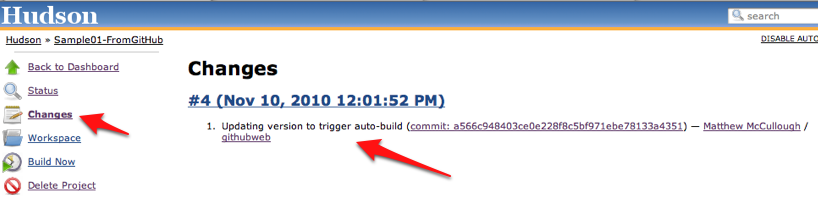
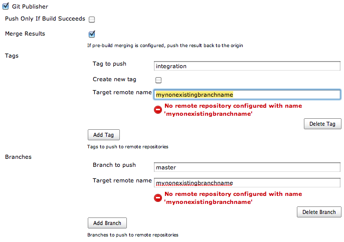

# Git Plugin
[Git](http://git-scm.com/) is a popular distributed version control system that is a logical successor to [Subversion](http://subversion.tigris.org/) and a mind-share competitor to [Mercurial](http://mercurial.selenic.com/). Git support in Hudson is both mature and full-featured. There are a number of plugins that can contribute to the overall story of Git on Hudson. The core Git-supporting plugin, [_Git Plugin_](http://wiki.hudson-ci.org/display/HUDSON/Git+Plugin) is where we'll begin. I'll discuss the supplemental plugins in a few minutes.

## Installing the Plugin
The _Git Plugin_ is available on the latest built-in list of plugins in the Hudson UI and is documented on its own [wiki page](http://wiki.hudson-ci.org/display/HUDSON/Git+Plugin). Simply check the check box and click the **install** button.

### System-wide Configuration of the Plugin
After installing the Git Plugin, a small new set of configuration options is available on the _Manage Hudson_ -> _Configure System_ page. This configuration supports satisfies the requirement that a [`git` binary](http://git-scm.com/download) version 1.3.3 or later must be installed and visible to Hudson.

### SSH Key Setup
If the Git repository you are accessing uses SSH passphrase-less authentication -- for example, if the access address is similar to `git@github.com:matthewmccullough/some-repo.git` -- you'll need to provide the private half of the key as file `~/.ssh/id_rsa` where `~` is the home directory of the user account under which Hudson is running.

The fingerprint of the remote server will additionally need to be placed in `~/.ssh/known_hosts` to prevent Hudson from invisibly prompting for authorization to access this git server for the first time.

Alternatively, if logging-in is enabled for the `hudson` user, SSH into the Hudson machine as `hudson` and manually attempt to git clone a remote repository. This will test your private key setup and establish the `known_hosts` file in the `~/.ssh` directory.

## Using the Plugin
On either an existing or a new Hudson project, a new _Source Code Management_ option for _Git_ is displayed. Upon making this choice, one or more repository addresses can be entered. Adding a second (optional) repository provides distinct named locations for `pull` and `push`.

### Advanced Per-Project Source Code Management Configuration
Clicking on the _Advanced_ button on the URL configuration provides more precise control of the `pull` behavior.

The _Name of repository_ is a shorthand title (a.k.a. `remote` in git parlance) for a given repository for later reference in the merge action configuration.

The _Refspec_ is a git-specific [language](http://progit.org/book/ch9-5.html) for controlling what is retrieved from remote servers and under what namespace it is stored locally.

### Branches to Build
The branch specifier is the wildcard pattern or specific branch name that should be built by hudson. If left blank, all branches will be built. At the time of this writing, after the first time saving a job with a blank _branches to build_ setting, it is populated with `**` which equally communicates "build all branches."

### Excluded Regions
Regions are named specific or wildcard paths in the codebase that, even when changed, should not trigger a build. Commonly these are non-compiled files such as localization bundles or images, which, understandably might not have an effect on unit or integration tests.

### Excluded Users
The git plugin allows for certain users to be ignored, even if they make changes to the codebase that would typically trigger a build.

Excluded users are typically automated users, not human developers, that happen to have distinct accounts with commit rights in the source control system. These automated users often are performing small numeric changes such as incrementing version numbers in a pom.xml file, not making actual logic changes. Each excluded username is specified on a separate line.

### Checkout/merge to local branch
Providing a value for this option causes a local branch to be created from the treeish you've specified to be built rather than a direct _detached HEAD_ checkout of the commit's hash.

Without a local branch specified:

    git checkout 73434e4a0af0f51c242f5ae8efc51a88383afc8a
    
versus with a local branch named `mylocalbranch` specified.

    git branch -D mylocalbranch
    git checkout -b mylocalbranch 73434e4a0af0f51c242f5ae8efc51a88383afc8a

### Local subdirectory for repo
The location on local disk for the clone of the repository can be chosen if a directory other than the default `workspace` directory is desired.

### Merge before build
The typical recipe for using this option is to fold a integration branch into a branch more similar to `master`. Keep in mind that only conflict-less merges will happen automatically. More complex merges that require manual intervention will fail the build.

The resultant merged branch will not automatically be pushed to another repository unless the later _push_ post-build action is enabled.

### Prune remote branches before build
Pruning removes local copies of remote branches that exist as a remnant of the previous clone, but are no longer present on the remote. In short, this is cleaning the local clone to be in perfect sync with its remote siblings.

### Clean after checkout
Activate git's facilities for purging any untracked files or folders, returning your working copy to a pristine state.

### Recursively update submodules
If using git's submodule facilities in the project, ensure that every submodule is up-to-date with an explicit call to `update`, even if submodules are nested within submodules.

### Use commit author in changelog
Hudson tracks and displays the author of changed code in a summarized view. Git tracks both the committer and author of code distinctly, and this option lets you toggle which of those two usernames is displayed in the changelog.

### Wipe out workspace
Typically Hudson will reuse the workspace, merely freshening the checkout as necessary and cleaning untracked files per the aforementioned switch. However, if a completely clean workspace is desired, this option will delete and rebuild it from the ground up. Bear in mind that this may significantly lengthen the time it takes to initialize and build the project.

### Choosing strategy
Hudson decides which branches to build based on a _strategy_. Users can influence this branch-search process. The default choice is to search for all branch HEADs. If the Gerrit plugin is installed, additional options for building all Gerrit-notified commits are displayed.

### Git executable
In the global options of Hudson, different Git executables can be set up and used on a per-build basis. This is infrequently used, and only when the clone or other git operations are highly sensitive to a particular version of Git. Git tends towards being very version-flexible; Slightly older repositories can easily be cloned with a newer version of git and vice-versa.

### Repository browser
Hudson can leverage a user-provided URL for web browser-based review of the source code Hudson detected was changed since the last build. This typically is a Gitorious, Git Web, or GitHub URL.

## Build Triggers
The basic git plugin offers the ability to _Poll SCM_ on a timed basis, looking for changes since the last inquiry. If changes are found, a build is started. The polling log is accessible via a link on the left hand side of the page in the navigation bar when viewing a specific job. It offers information on the last time the repository was polled and if it replied with a list of changes.

The git polling is distilled into a more developer-useful format that shows commit comments as well as hyperlinking usernames and changed files to more detailed views of each.

Installing the _Gerrit Build Trigger_ adds a _Gerrit event_ option that can be more efficient and precise than simply polling the repository.

### Gerrit Trigger
[Gerrit](http://code.google.com/p/gerrit/) is an open source web application that facilitates [code reviews](https://review.source.android.com/#q,status:open,n,z) for project source hosted on a git version control system. It reads a traditional git repository, and provides a side by side comparison of changes. As the code is reviewed, Gerrit provides a location to comment and move the patch to an _open_, _merged_, or _abandoned_ status.

The [Gerrit Trigger](http://wiki.hudson-ci.org/display/HUDSON/Gerrit+Trigger) is a Hudson plugin that can trigger a Hudson build of the code when any user-specified activity happens in a user-specified project in the git repository. It is a alternative to the more typically-used _Build periodically_ or _Poll SCM_.

The configuration for this plugin is minimal and focused on the _Project Type_ and _Pattern_ and _Branch Type_ and _Pattern_. In each pair, the _type_ can be _Plain_, _Path_, or _RegExp_ -- pattern flavors of what to watch -- and then the value (_pattern_) to evaluate using the _type_ as the guide.

## Post-build Actions
The git plugin for Hudson adds git-specific capabilities to the post-processing of the build artifacts. Specifically, the _Git Publisher_ offers merging and pushing actions.

### Push Only If Build Succeeds
If a merge or other commit-creating action has been taken during the Hudson build, it can be enabled to push to a remote.

### Merge Results
If pre-build merging is configured, push the merge-resultant branch to its origin.

### Tags
When pushing tags, each tag can be named and chosen to be created if it does not exist (which fails if it does already exist). Environment variables can be embedded in the tag name. Examples include the process ID such as `HUDSON_BUILD_$PPID` or even a build number, if that is provided by a Hudson plugin, such as `$HUDSON_AUTOTAG_$BUILDNUM`. Tags can be targeted to a specific remote such as `origin` or `integrationrepo`.

### Branches
The current HEAD used in the Hudson build of the application can be pushed to other remotes as an after-step of the build. Merely the destination branch name and remote name need to be provided.

Names of remotes are validated against the earlier configuration of the plugin. If the remote doesn't exist, a warning is displayed.

# GitHub Plugin
The GitHub plugin offers two integration points. First, it offers an optional link to the project's GitHub homepage. Simply enter the URL for the project (without the tree/master or tree/branch part). For example, `http://github.com/matthewmccullough/git-workshop`.

Second, the GitHub plugin offers per-file-changed links that are wired via the _Repository browser_ section of a job's _Source Code Management_ configuration.

With the `githubweb` repository browser chosen, all changed-detected files will be linked to the appropriate GitHub source-viewing web page.

